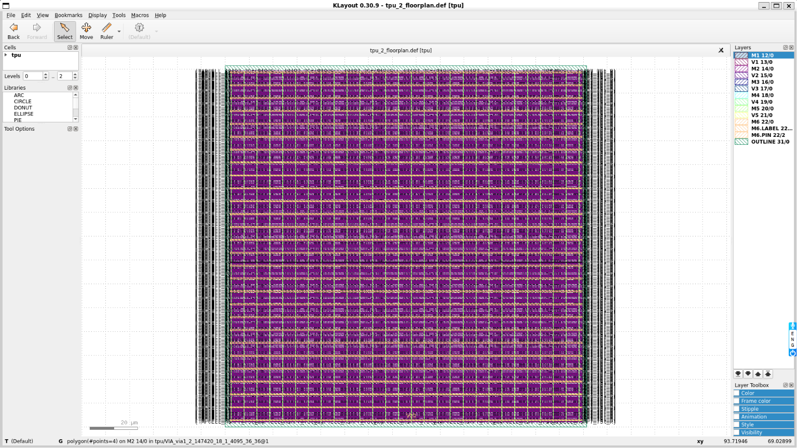
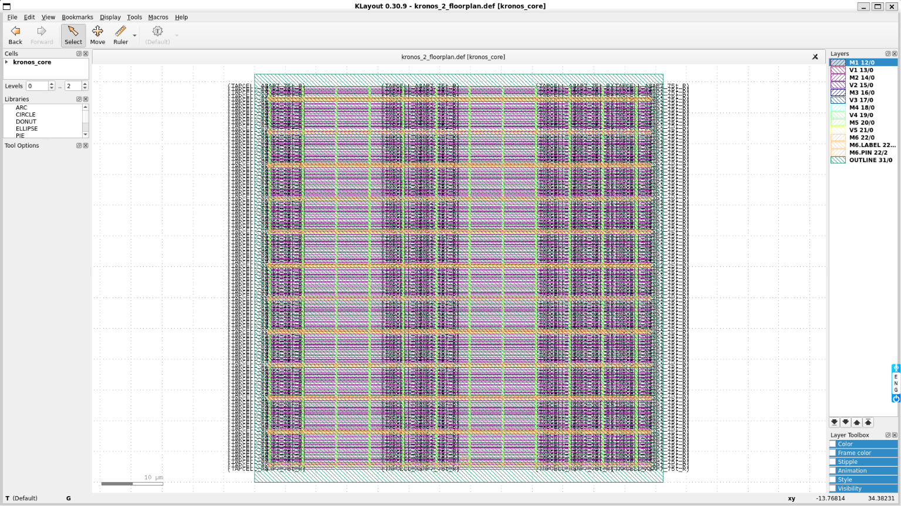
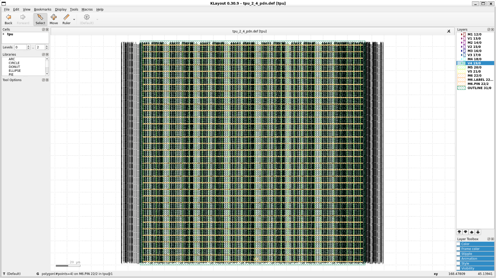
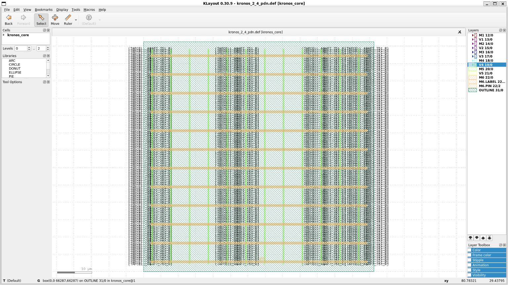
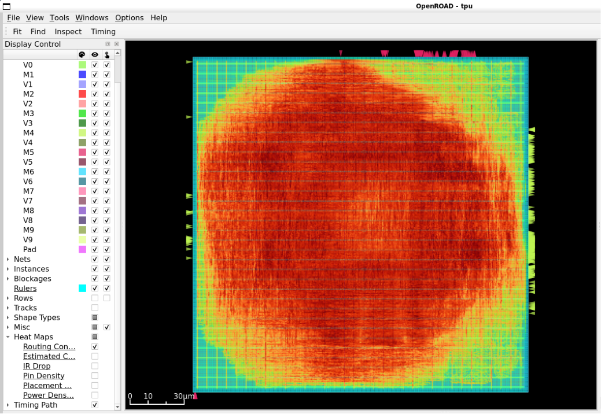
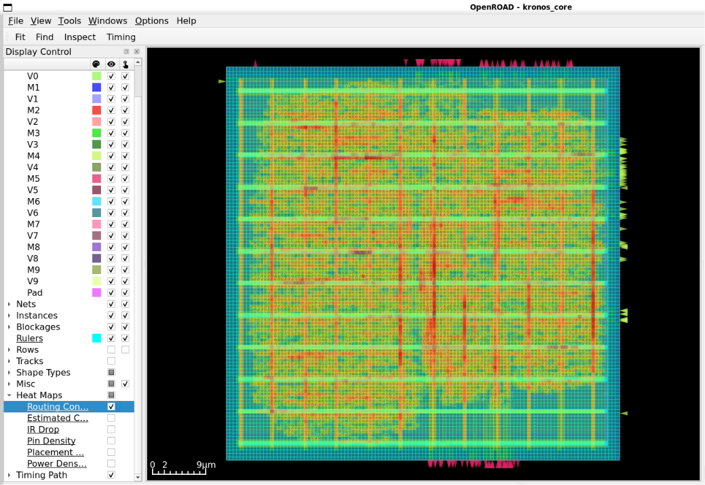
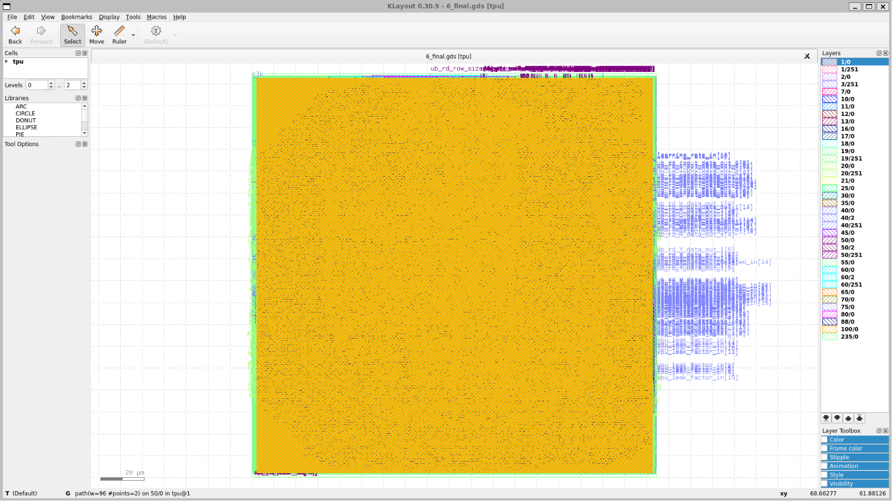
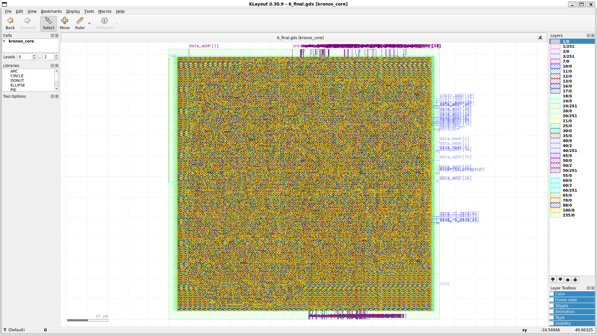
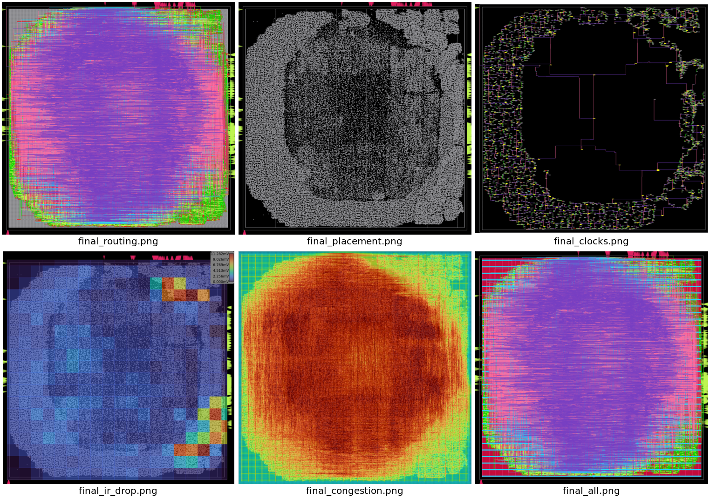
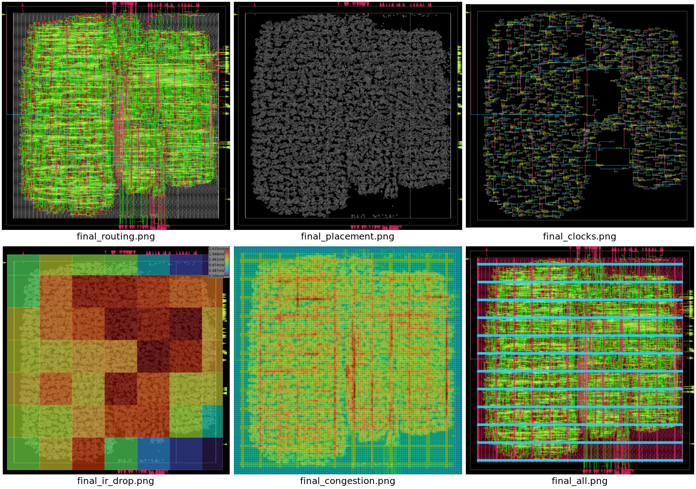

# Week 5 — RTL-to-GDSII Flow: TPU + Kronos (ORFS, ASAP7)

📂 [View this project on GitHub](https://github.com/nurmdabd/Asmicore-Projects/tree/master/RTL-to-GDSII-Flow/Week-05-RTL-PnR-flow)
*(part of the [Asmicore-Projects](https://github.com/nurmdabd/Asmicore-Projects) monorepo → `RTL-to-GDSII-Flow/Week-05-RTL-PnR-flow`)*

Full RTL-to-GDSII physical design flow for two designs, run through
[OpenROAD-flow-scripts](https://github.com/The-OpenROAD-Project/OpenROAD-flow-scripts)
(ORFS) on the open-source **ASAP7** 7nm predictive PDK:

- **TPU** — a systolic-array tensor processing unit (`OpenRoad/tiny-tpu`)
- **Kronos** — a RISC-V core (`OpenRoad/kronos`)

Both designs were carried from floorplanning through a final,
tapeout-ready GDS across five stages: floorplan → power planning →
placement → clock tree synthesis (CTS) → routing and finishing.

The full writeup is a day-by-day lab notebook
([`Week5_Runbook_TPU_Kronos.md`](./Week5_Runbook_TPU_Kronos.md)): every
metric is sourced from ORFS's per-stage `.json` metrics files (the
primary source of truth throughout, with log greps used only as
secondary cross-checks), and each day closes with worked answers to a
set of technical questions (timing degradation, DRC root causes,
congestion, buffer counts, etc. — 20 in total). **This README summarizes
that report and, in particular, walks through every problem hit along
the way and how each one was diagnosed and fixed.**

---

## Results at a Glance

| | **TPU** (600 MHz) | **Kronos** (1000 MHz) |
|---|---|---|
| Final die area | 34,104.9 µm² (184.675 × 184.675 µm) | 4,393.97 µm² (66.287 × 66.287 µm) |
| Standard cells (final) | 250,429 (incl. 158,304 filler/decap) | — |
| DRC violations | 0 | 0 |
| Antenna violations | 0 (no diode cell on this platform — jumpering only) | 0 |
| Timing met? | ✅ +443.9 ps margin (post-GRT est., 6,506 endpoints) | ✅ +301.1 ps margin (post-GRT est.) |
| Synthesis → post-route degradation | 279.7 ps (16.8% of clock period) | 168.6 ps (16.9% of clock period) |
| Detailed-route convergence | 8 iterations, 3h 22m 50s (79,920 → 0 violations) | 7 iterations, ~16m 23s (4,053 → 0) |
| Peak memory (detailed route) | 19.5 GB (near a 20 GB WSL2 ceiling) | 4.4 GB |
| IR drop (VDD / VSS) | 1.58% / 1.47% | 0.34% / 0.32% — notably healthier |
| Total wall-clock (full flow) | 4h 14m 55s | 18.2 min |
| Final GDS size | 199 MB | 18 MB |

Both designs finished **clean and tapeout-ready**, but got there very
differently: Kronos succeeded on its first attempt with no config
changes all week. TPU hit a hard routing-congestion failure on Day 5 and
needed **three routing attempts, an out-of-memory crash, and a config
rework** (utilization 45%→30%, placement density 0.60→0.45,
`MAX_ROUTING_LAYER=M8`) to reach a working result — the full story is in
[Problems & Solutions](#problems--solutions) below.

---

## Repository Structure

```
Week-05-RTL-PnR-flow/
├── README.md                                  # this file
├── Week5_Runbook_TPU_Kronos.md                # full day-by-day report
├── figures/                                    # KLayout / OpenROAD GUI screenshots
│   ├── day1_step3_tpu_klayout_floorplan.png
│   ├── day1_step3_kronos_klayout_floorplan.png.png
│   ├── day2_step2_tpu_klayout_pdn_view.png
│   ├── day2_step2_kronos_klayout_pdn_view.png
│   ├── day3_step1_tpu_placement_congestion_heatmap.png
│   ├── day3_step1_kronos_placement_congestion_heatmap.png
│   ├── day5_step4_tpu_klayout_final_gds.png
│   ├── day5_step4_kronos_klayout_final_gds.png
│   ├── day5_step4_tpu_report_visualization_panel.png
│   └── day5_step4_kronos_report_visualization_panel.png
└── OpenRoad/
    ├── tiny-tpu/
    │   ├── rtl/                                # TPU Verilog sources (systolic.v, pe.v, vpu.v, tpu.v, ...)
    │   └── run_600mhz/
    │       └── configs/
    │           ├── config_600mhz.mk            # final, working TPU config (30% util / 0.45 density / M8)
    │           └── constraint_600mhz.sdc
    └── kronos/
        ├── rtl/
        │   ├── core/                           # kronos_core.sv + ALU/AGU/CSR/LSU/RF/IF/ID/EX/HCU/branch/counter
        │   ├── memory/                          # generic + ice40up SRAM/ROM models
        │   ├── peripherals/                     # UART, SPI, FIFO, debouncer
        │   └── platform/                        # krz + snowflake SoC platform wrappers
        └── run_1000mhz/
            └── configs/
                ├── config_1000mhz.mk            # Kronos config (unchanged all week)
                └── constraint_1000mhz.sdc
```

> **Note:** `figures/day1_step3_kronos_klayout_floorplan.png.png` has a
> doubled `.png.png` extension in the current tree (a leftover from a
> download/rename step) — the path below matches the file as it
> actually exists on disk. Worth a one-line rename for consistency.

> ORFS output layout: results, logs, and reports land under
> `results|logs|reports/asap7/<design>/<run_type>/` as **flat files**
> (no per-stage subfolders), with intermediate checkpoints stored as
> `.odb` databases rather than `.def`. Every stage log has a matching
> `.json` metrics file (e.g. `2_1_floorplan.json`, `3_5_place_dp.json`,
> `4_1_cts.json`) already expressed in real units (µm², ps, Hz) — no
> DBU/scaling conversion needed to read them. This directory isn't
> checked into the repo tree above (it's generated by the flow), but
> that's the path every command below writes to.

---

## Toolchain & Requirements

- [OpenROAD-flow-scripts (ORFS)](https://github.com/The-OpenROAD-Project/OpenROAD-flow-scripts)
- **ASAP7** PDK (`PLATFORM = asap7`)
- [KLayout](https://www.klayout.de/) for GDS/DEF viewing — needs the
  ASAP7 tech **and** standard-cell LEF merged via Reader Options (see
  [Problem 1](#problem-1-klayout-shows-standard-cells-as-blank-placeholder-boxes) below), or floorplans render with blank placeholder cells
- **≥20 GB of RAM available to the router.** If running under WSL2, the
  default memory cap (~50% of host RAM or 8 GB, whichever is smaller)
  is not enough for detailed routing on a design TPU's size — see
  [Problem 4](#problem-4-detailed-routing-crashes-with-no-error-message)
- `slang` as the Yosys HDL frontend for Kronos (`SYNTH_HDL_FRONTEND = slang`, needed for its SystemVerilog sources)

---

## Quick Start

Both designs are driven by ORFS's standard `make` targets against their
respective `config.mk`:

```bash
# Sanity-check the toolchain against either design's config
make DESIGN_CONFIG=<path-to-config.mk> check-yosys check-openroad check-klayout

# TPU (final, working configuration — 30% utilization / 0.45 density / M8)
make DESIGN_CONFIG=OpenRoad/tiny-tpu/run_600mhz/configs/config_600mhz.mk floorplan
make DESIGN_CONFIG=OpenRoad/tiny-tpu/run_600mhz/configs/config_600mhz.mk place
make DESIGN_CONFIG=OpenRoad/tiny-tpu/run_600mhz/configs/config_600mhz.mk cts
make DESIGN_CONFIG=OpenRoad/tiny-tpu/run_600mhz/configs/config_600mhz.mk route
make DESIGN_CONFIG=OpenRoad/tiny-tpu/run_600mhz/configs/config_600mhz.mk finish

# Kronos
make DESIGN_CONFIG=OpenRoad/kronos/run_1000mhz/configs/config_1000mhz.mk floorplan
make DESIGN_CONFIG=OpenRoad/kronos/run_1000mhz/configs/config_1000mhz.mk place
make DESIGN_CONFIG=OpenRoad/kronos/run_1000mhz/configs/config_1000mhz.mk cts
make DESIGN_CONFIG=OpenRoad/kronos/run_1000mhz/configs/config_1000mhz.mk route
make DESIGN_CONFIG=OpenRoad/kronos/run_1000mhz/configs/config_1000mhz.mk finish
```

`make route` alone only produces a global/detailed-route checkpoint;
`make finish` is required afterward to produce the final GDS. Power
delivery network (PDN) generation is folded into `make floorplan`.

**⚠️ Important — changing `MAX_ROUTING_LAYER` or `ROUTING_LAYER_ADJUSTMENT`
requires a full clean re-run from `floorplan`, not just `route`.** Both
variables are consumed once during the floorplan stage and baked into
the `.odb` database; a routing-only re-run silently ignores changes to
them. This cost a full debugging cycle during TPU's Day 5 work — see
[Problem 3](#problem-3-a-config-change-that-silently-had-no-effect).

**Note on TPU's config history:** `config_600mhz.mk` in this repo is
the **final** version that produced the clean, tapeout-ready GDS.
Days 1–4's TPU data in the report were captured under the *original*
45% utilization / 0.60 density settings, as part of learning the flow —
a distinct, earlier run, documented as such throughout, not a
correction to the final numbers.

---

## Flow Walkthrough

| Day | Stage | TPU headline | Kronos headline |
|---|---|---|---|
| **Day 0** | Verify inputs, target die area | Synthesis outputs verified; die area target calculated from cell count × avg. cell area | Same |
| **Day 1** | Floorplan | 45.7% actual utilization, 21,692.9 µm² core, 545 rows, 397 IO pads | 45.5% utilization, 3,863.12 µm² core, 230 rows, 174 IO pads |
| **Day 2** | Power planning | M5/M6 stripe mesh, 28+28 stripes, 6,309.4 µm² power metal, 0 unconnected rails | M5/M6 stripe mesh, 12+12 stripes, 1,134.0 µm² power metal, 0 unconnected rails |
| **Day 3** | Placement | 89,431 cells; **26.85% tile overflow — the first warning sign of Day 5's congestion failure** | 13,919 cells; 0% tile overflow — clean |
| **Day 4** | CTS | 199 clock buffers (5-level tree), 4.90% skew, timing met | 112 clock buffers (4-level tree), 2.74% skew, timing met |
| **Day 5** | Route + Finish | 3 attempts, 1 config bug, 1 OOM crash → clean success at 30%/0.45/M8 | Clean success, first attempt, ~16 min |

### Day 1 — Floorplan

<p align="center">
  <a href="figures/day1_step3_tpu_klayout_floorplan.png" target="_blank"></a>
  <a href="figures/day1_step3_kronos_klayout_floorplan.png.png" target="_blank"></a>
</p>
<p align="center"><em>Left: TPU floorplan. Right: Kronos floorplan. Both loaded in KLayout with real cell geometry after the LEF-merge fix (Problem 1).</em></p>

Sanity-checked against site geometry independently of the JSON metrics:
TPU's 545 rows × 0.270 µm tall × 2,730 sites/row × 0.054 µm wide ≈
21,696 µm², within 0.02% of the confirmed 21,692.9 µm² core area.
Kronos's 230 × 0.270 × 1,152 × 0.054 ≈ 3,863.1 µm², an almost exact match
to 3,863.12 µm².

### Day 2 — Power Planning

<p align="center">
  <a href="figures/day2_step2_tpu_klayout_pdn_view.png" target="_blank"></a>
  <a href="figures/day2_step2_kronos_klayout_pdn_view.png" target="_blank"></a>
</p>
<p align="center"><em>Left: TPU's M1/M2 followpin rails + M5/M6 stripe mesh. Right: Kronos, same shared grid strategy, no ring — stripes only for both designs.</em></p>

### Day 3 — Placement

<p align="center">
  <a href="figures/day3_step1_tpu_placement_congestion_heatmap.png" target="_blank"></a>
  <a href="figures/day3_step1_kronos_placement_congestion_heatmap.png" target="_blank"></a>
</p>
<p align="center"><em>Left: TPU's post-placement congestion heatmap — final weighted congestion 1.4115 vs. a 1.01 target, never resolved. Right: Kronos, 0.6879, well under target. This gap is what breaks TPU's routing two days later.</em></p>

| Metric | TPU | Kronos |
|---|---|---|
| Placement worst slack | +0.0784 ns | +0.339 ns |
| Slack lost vs. synthesis | 0.645 ns (38.7% of clock period) | 0.130 ns (13.0% of clock period) |
| Tile overflow | 18,858 tiles (26.85%) | 0 tiles (0.00%) |

### Day 4 — Clock Tree Synthesis

| Metric | TPU | Kronos |
|---|---|---|
| Max skew | 0.0817 ns (4.90% of period) | 0.0274 ns (2.74% of period) |
| Buffers inserted | 198 tree + 1 resizer repair = 199 | 112 tree + 0 repair |
| Clock endpoints (FFs) | 3,040 | 1,933 |
| Post-CTS setup slack | +0.0736 ns | +0.3415 ns |
| Hold violations | 0 | 0 |

### Day 5 — Routing & Finish

<p align="center">
  <a href="figures/day5_step4_tpu_klayout_final_gds.png" target="_blank"></a>
  <a href="figures/day5_step4_kronos_klayout_final_gds.png" target="_blank"></a>
</p>
<p align="center"><em>Final, tapeout-ready GDS for both designs, opened in KLayout. TPU (left, 20 µm scale bar) vs. Kronos (right, 10 µm scale bar) — both show a clean die outline with uniform fill and no DRC markers.</em></p>

Full attempt-by-attempt breakdown is in [Problems & Solutions](#problems--solutions) below.

---

## Problems & Solutions

**Both designs started with identical physical-design settings**
(45% utilization, 0.60 density, same aspect ratio and margin) despite
TPU being roughly **6.4× larger by instance count** (89,431 vs. 13,919
at placement) and having a systolic-array architecture with much longer
average interconnect. That "one target fits both" starting point is the
most likely root cause of everything that follows: Kronos sailed through
on those numbers, TPU didn't. Six distinct problems were hit and
resolved across the week — one in Day 1 tooling, five in Day 5's routing
investigation.

### Problem 1: KLayout shows standard cells as blank placeholder boxes

- **When:** Day 1, viewing the exported floorplan DEF.
- **Symptom:** Launching KLayout with all platform LEF files passed as
  separate command-line arguments (`klayout platforms/asap7/lef/*.lef
  ... .def`) produced ~59 "Macro not found in LEF file" warnings,
  covering nearly every standard-cell type. Die/core boundary, rows, and
  metal layers M1–M6 rendered correctly; only standard-cell geometry was
  affected, showing as uniform placeholder boxes.
- **Root cause:** not a missing file — the real `asap7sc7p5t` LEF exists
  on disk (391 KB) and is valid. Passing multiple LEF files as separate
  arguments makes KLayout open each as an independent tab instead of
  merging them into one macro library the DEF reader can resolve
  geometry against.
- **Fix:** merge the LEFs explicitly through `File → Reader Options →
  LEF/DEF → LEF+Macro Files`, adding the tech LEF first, then the
  standard-cell macro LEF (`asap7sc7p5t_28_R_1x_220121a.lef`) — order
  matters. Then `File → Open` the DEF directly, with no LEF arguments on
  the command line.
- **Result:** confirmed three independent ways — a clean Log Viewer load
  sequence with zero "Macro not found" lines, a filtered terminal
  relaunch returning nothing, and visual confirmation of real, varied
  cell geometry. The Reader Options setting persists into KLayout's
  application config, so it applied automatically on all later launches.
- **A related wrinkle for Kronos:** the same multi-argument LEF launch
  failed *harder* — a hard crash (`ERROR: Duplicate MACRO name:
  A2O1A1Ixp33_ASAP7_75t_R`) instead of TPU's soft warnings, consistent
  with the same root cause (conflicting/duplicate LEF inputs from the
  glob) producing a different failure mode on a different design. The
  persisted Reader Options fix resolved it identically.
- **Aside:** WSL2's GPU/render path can separately produce a blank
  KLayout window unrelated to this issue; fix is launching with
  `LIBGL_ALWAYS_SOFTWARE=1`.

### Problem 2: TPU fails global routing outright (Attempt 1)

- **When:** Day 5, first routing attempt, original config (45%
  utilization, 0.60 density, M7 max routing layer).
- **Symptom:** `[ERROR GRT-0116] Global routing finished with
  congestion.` after 3h 24m and 5 congestion-recovery restart loops.
  Worst layer (M3) hit 95.32% utilization; total overflow reached 89,142.
  Detailed routing was never reached.
- **Root cause:** predicted two days earlier — Day 3 placement never hit
  its congestion target (weighted congestion 1.4115 vs. a 1.01 target,
  26.85% tile overflow). Pre-route resource derating had already cut
  26–33% off every layer's track budget before a single net was routed,
  on a design with 6.4× the instances and much longer average
  interconnect than the config's density setting was tuned for.
- **Fix (first pass):** lower `CORE_UTILIZATION` (45→35) and
  `PLACE_DENSITY` (0.60→0.50) to open up routing headroom.
- **Result:** placement congestion improved (1.4115 → 1.2304) but still
  above target — not sufficient on its own; led into Attempt 2.

### Problem 3: A config change that silently had no effect

- **When:** Day 5, Attempt 2 — `MAX_ROUTING_LAYER=M8` added to
  `config.mk`, routing re-run *without* re-running floorplan (on the
  assumption that a routing-layer setting only affects the routing
  stage).
- **Symptom:** Global routing still failed (`GRT-0116`), and the log
  showed `Max routing layer: M7` — M8 was never actually applied, even
  though total overflow *did* drop dramatically (89,142 → 101, an ~880×
  improvement) purely from the utilization/density change.
- **Root cause:** `grep -rn "MAX_ROUTING_LAYER" scripts/*.tcl` showed
  both `MAX_ROUTING_LAYER` and `ROUTING_LAYER_ADJUSTMENT` are consumed
  **once, during the floorplan stage**, then baked into the `.odb`
  database and carried forward unchanged through placement, CTS, and
  routing. M8 had been added *after* floorplan/place/CTS had already
  completed against the old M7 database, so routing never saw it.
- **Fix:** any change to either variable requires a full clean and
  re-run starting from `floorplan`, not just `route`.
- **Result:** with a full clean re-run (Attempt 3), global routing
  succeeded outright — 0 congestion violations, 61.32% total usage (down
  from Attempt 2's 74.71%).

### Problem 4: Detailed routing crashes with no error message

- **When:** Day 5, first detailed-routing attempt after Attempt 3's
  successful global route.
- **Symptom:** Silent crash mid-run (0th iteration, ~50% complete,
  25,880 violations still present, memory climbing to ~11 GB) — no
  tool-level error, just `make: Error 247`.
- **Root cause:** `dmesg -T | grep -i "killed process\|out of memory"`
  showed `Out of memory: Killed process 3557 (openroad)
  total-vm:18095556kB, anon-rss:11449216kB`. WSL2 defaults to capping
  its own memory at roughly 50% of host RAM (or 8 GB, whichever is
  smaller) — the machine has 24 GB physical RAM, but WSL was only
  allowing ~11 GB, right at detailed routing's peak memory ceiling.
- **Fix:** raise the WSL2 memory ceiling from the Windows side:
  ```ini
  # .wslconfig, Windows user profile
  [wsl2]
  memory=20GB
  processors=8
  swap=8GB
  ```
  ```powershell
  wsl --shutdown
  ```
- **Result:** confirmed inside Ubuntu afterward (`Mem: 19Gi total, 18Gi
  available`). Detailed routing then reran and converged cleanly:
  97,676 → 111 violations over 16 iterations (a 99.89% reduction),
  memory stable at 15.6–16.1 GB throughout — comfortably under the new
  ceiling. This fix later proved essential, not just precautionary: the
  final successful run's iteration 0 alone hit 19.5 GB, and peak memory
  reached 19.96 GB — right at the edge of even the raised 20 GB limit.

### Problem 5: A stubborn, non-congestion violation category on M8

- **When:** Day 5, after the OOM fix — detailed routing converged to
  99.89% (97,676 → 111 violations) but stalled there instead of
  reaching zero.
- **Symptom:** Layer M8's "Min Step" violations became the dominant
  remainder (65 of the final 111 violations by iteration 16: 30 Min
  Step, 29 Short, 6 Metal Spacing), and this category *oscillated*
  rather than converging monotonically across iterations (e.g. iter 11:
  54 → iter 12: 56 → iter 13: 32).
- **Root cause:** a geometric legality rule (minimum spacing between
  successive same-net shape segments), not a congestion/capacity issue.
  M8's track pitch (0.08 µm) is coarser than M7's (0.064 µm), plausibly
  producing Min Step conflicts that rip-up-and-reroute struggles to
  resolve through iteration alone.
- **Investigated and ruled out:** reverting `MAX_ROUTING_LAYER` back to
  M7. Comparing global-routing resource tables between the failed
  M7-only run and the successful M8-added run showed nearly identical
  M2–M7 resource figures (e.g. M3: 1,015,102 in both), and
  `ROUTING_LAYER_ADJUSTMENT=0.16` showed `Global adjustment: 0%` in both
  logs — meaning the entire routing improvement came from M8's added
  capacity alone (+460,161 resource units), not the adjustment setting.
  Reverting to M7-only would very likely have reproduced the original
  `GRT-0116` failure.
- **Fix:** rather than fight the M8 geometric edge case directly, reduce
  density further to give the router more room overall — see Problem 6.

### Problem 6: The actual fix — trading die area for routability *and* timing

- **When:** Day 5, final configuration.
- **Fix:** `CORE_UTILIZATION` 35→**30**, `PLACE_DENSITY` 0.50→**0.45**
  (kept `MAX_ROUTING_LAYER=M8` and `ROUTING_LAYER_ADJUSTMENT=0.16`), full
  clean re-run from floorplan through `finish`.
- **Result:** complete, clean success —
  - Global route: 0 congestion, 54.55% total usage (down from Attempt
    3's 61.32%), 92,140 nets, 1,974,758 µm wirelength.
  - Detailed route: 79,920 → 0 violations over 8 iterations, 3h 32m
    (~83% of total flow runtime), peak memory 19.5 GB.
  - Final: 0 DRC, 0 antenna violations, 0 setup/hold violations, clean
    tapeout-ready GDS.
  - **Bonus:** the more-open layout didn't just fix routability — it
    also improved timing margin. Synthesis worst slack (723.59 ps) vs.
    post-global-route slack (+443.888 ps) is a 279.7 ps (16.8%)
    degradation, notably smaller than what the tighter, ultimately
    unroutable configurations were trending toward. A more open layout
    means shorter, cleaner routes with less parasitic delay — this
    config traded die area for **both** routability and timing headroom,
    not routability alone.

**TPU's full arc** — congestion failure → utilization/density fix →
a silently-ignored config change → an OOM crash → a stubborn geometric
edge case → a final density fix that solved routability and improved
timing together — resolved distinct problem types spanning tool
configuration, memory limits, and true physical-design tradeoffs.
Kronos's own experience (clean placement, clean route, first attempt) is
the "normal" pattern that TPU's original 45% attempt deviated from, and
is a useful contrast throughout.

| | TPU attempt 1 | TPU attempt 2 | TPU attempt 3 (+M8) | **TPU final (30%/0.45)** | Kronos |
|---|---|---|---|---|---|
| Global route | Failed, 5 restarts | Failed, 0 restarts | Succeeded, 0 congestion | **Succeeded, 54.55% usage** | Succeeded |
| Detailed route | Never reached | Never reached | OOM → fixed → 99.89%, stalled on M8 | **0 DRC violations** | Succeeded |
| Result | Failed | Failed | Blocked (DRT stalled) | **Clean, tapeout-ready GDS** | Clean GDS |
| Total time | 3h 24m (failed) | 59m (failed) | GRT fast, DRT ~4.5h (incomplete) | **4h 15m (complete)** | 18.2 min |
| Peak memory | 4.1 GB | 3.48 GB | ~11 GB OOM → 15.6–16.1 GB fixed | **19.5 GB** (near 20 GB ceiling) | 4.6 GB |

---

## Known Limitations / Open Items

A few items in the full report are flagged as incomplete or preliminary
rather than final answers:

- **M1 density (corner vs. centre):** both final GDS files were
  confirmed to open cleanly in KLayout, and a first visual pass (see the
  final-GDS screenshots above) shows no obvious density gradient, but
  this used the merged fill layer, not an isolated M1 layer or a real
  density/heatmap tool — treat as a preliminary observation, not a
  rigorous measurement.
- **ORFS auto-generated report panels** (`.webp` routing/placement/CTS/
  IR-drop/congestion visualizations under each design's `reports/`
  directory) were not confirmed as fully populated at the time of
  writing.
- **Clock latency** (launch/capture path) was not extracted for either
  design — would require `report_clock_latency`, not present in the
  current data.
- TPU's Day 5 per-stage timing breakdown (as opposed to synthesis→final
  overall) was not individually re-extracted for the final 30%
  configuration.

---

## Figure Gallery

<p align="center">
  <a href="figures/day5_step4_tpu_report_visualization_panel.png" target="_blank"></a>
  <a href="figures/day5_step4_kronos_report_visualization_panel.png" target="_blank"></a>
</p>
<p align="center"><em>ORFS's auto-generated final-report visualization panels (routing, placement, clock tree, IR-drop, congestion) for TPU (left) and Kronos (right).</em></p>

| File | Captures | Day / Step |
|---|---|---|
| `day1_step3_tpu_klayout_floorplan.png` | TPU floorplan in KLayout, real cell geometry, M1–M6/V1–V5 | Day 1, Step 3 |
| `day1_step3_kronos_klayout_floorplan.png.png` | Kronos floorplan in KLayout | Day 1, Step 3 |
| `day2_step2_tpu_klayout_pdn_view.png` | TPU PDN (M1/M2 followpin + M5/M6 stripes) | Day 2, Step 2 |
| `day2_step2_kronos_klayout_pdn_view.png` | Kronos PDN, same shared grid strategy | Day 2, Step 2 |
| `day3_step1_tpu_placement_congestion_heatmap.png` | TPU post-placement congestion heatmap | Day 3, Step 1 |
| `day3_step1_kronos_placement_congestion_heatmap.png` | Kronos post-placement congestion heatmap (clean) | Day 3, Step 1 |
| `day5_step4_tpu_klayout_final_gds.png` | TPU final tapeout-ready GDS | Day 5, Step 4 |
| `day5_step4_kronos_klayout_final_gds.png` | Kronos final GDS | Day 5, Step 4 |
| `day5_step4_tpu_report_visualization_panel.png` | ORFS auto-generated report panel, TPU | Day 5, Step 4 |
| `day5_step4_kronos_report_visualization_panel.png` | ORFS auto-generated report panel, Kronos | Day 5, Step 4 |

---

## Full Report

For the complete methodology — exact commands, JSON metric key
conventions, per-stage metrics tables, and worked answers to all 20
technical questions (4 per day × 5 days) — see:

📄 [`Week5_Runbook_TPU_Kronos.md`](./Week5_Runbook_TPU_Kronos.md)
